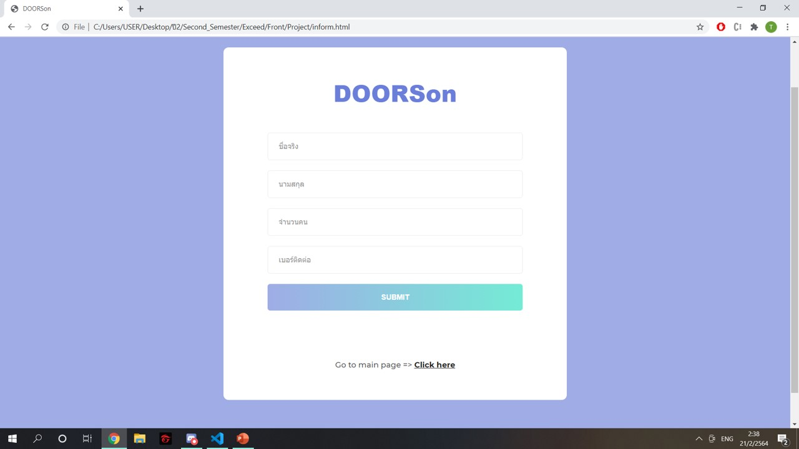
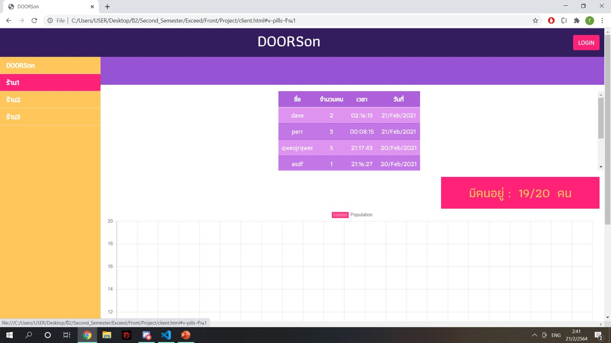
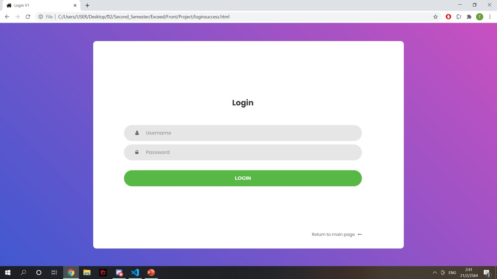
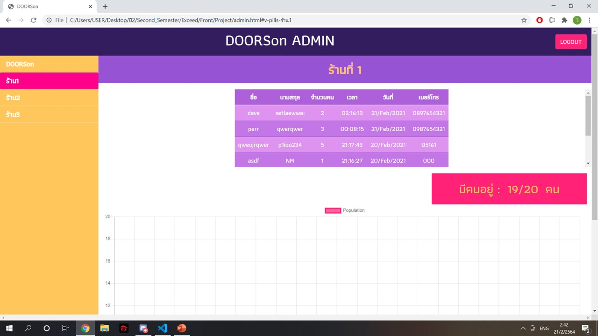

# ExceedFront
Exceed camp 2021 FrontEnd

DooRSon เกิดมาจากการติดเชื้อเวลาจับประตูในยุคของ COVID-19 แล้วไม่สามารถติดตามผู้ที่เข้าร้านในช่วงนั้นได้หากมีผู้ติดเชื้อ เพราะไม่สแกนแอพไทยชนะ DooRSon จึงใช้การยืนยันตัวตนก่อนเข้าสู่ร้านด้วยประตูอัตโนมัติ ทำให้สามารถติดตามลูกค้าที่เข้าร้านได้ว่าเข้าและออกร้านในเวลาไหน ดูและจำกัดจำนวนคนที่เข้าร้านในแต่ละช่วงเวลาได้เพื่อลดความเสี่ยงในการเข้าร้านอาหาร

<a href="https://youtu.be/9pnRzLVnOIA">Clip Demo<a>
  
<h1>สิ่งที่ Frontend ทำได้</h1>

<ol>
<li>เก็บข้อมูลคนที่เข้าร้าน โดยกรอกข้อมูลและ Submit ผ่าน Form มี(ชื่อ, นามสกุล, เบอร์โทรศัพท์, จำนวนคน, วันที่ และเวลาที่submit)</li> 
<li>Page for user (client.html) สำหรับลูกค้า ไม่จำเป็นต้อง Login เพื่อใช้งาน มีตารางแสดงประวัติคนที่เคยเข้าร้านนั้น (แสดงข้อมูลบางส่วน ชื่อ จำนวนคน เวลา และวันที่) มีกราฟแสดงจำนวนคน มีตัวเลขจำนวนคนในร้านขณะนั้น</li> 
<li>Page for admin (admin.html) สำหรับ Admin จำเป็นต้อง Login เพื่อใช้งาน แสดงคล้าย client.html แต่แสดงข้อมูลทั้งหมดที่มี (เพิ่มนามสกุล และเบอร์โทรศัพท์เพื่อติดต่อหาเผื่อมีคนติดเชื้อเข้ามาที่ร้าน)</li> 
<li>หน้า Login สำหรับ Admin</li>
</ol>

<h1>ตัวอย่างหน้าเว็บ</h1>

หน้า SUBMIT Form สำหรับการเก็บข้อมูลของลูกค้าที่เข้าร้านเพื่อเก็บใน Database

หน้า CLIENT สำหรับการแสดงข้อมูลลูกค้า สำหรับให้คนทั่วไปมาดูได้ (เห็นแค่บางข้อมูลเท่านั้น) แยกตามร้าน

หน้า LOGIN สำหรับให้คนที่เป็น Admin Login เข้าไปดูข้อมูลทั้งหมดได้

หน้า ADMIN สำหรับการแสดงข้อมูลลูกค้า ที่แสดงข้อมูลทั้งหมดที่เก็บมา แยกตามร้าน

นาย ธีรธัช พิศาลสินธุ์ 6210503616
นาย นทวัจน์ เมี้ยนละม้าย 6210503624
นาย สิทธิเจตจน์ วงศ์ทิชาวัฒน์ 6210503853
